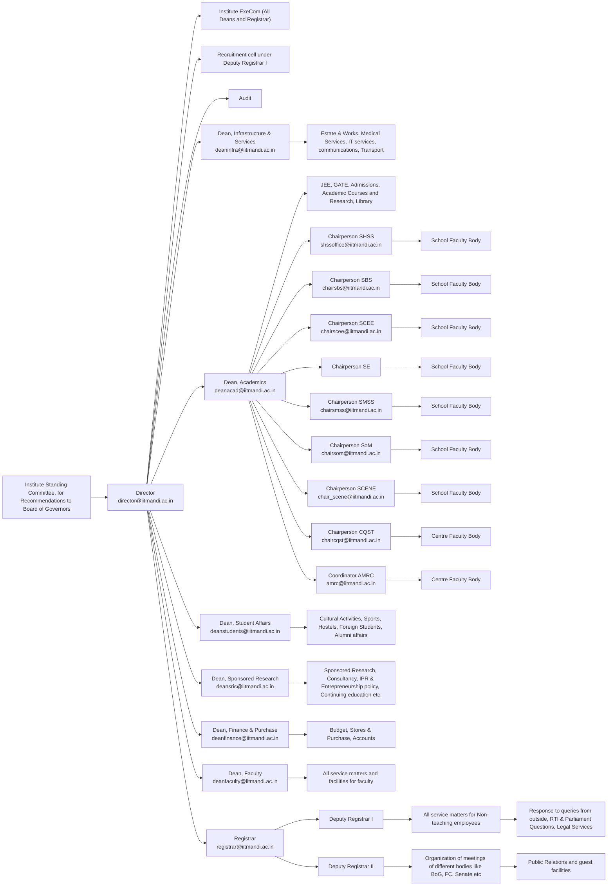

```mermaid
graph LR
    %% Executive Level
    ISC["Institute Standing Committee, for Recommendations to Board of Governors"]
    Director["Director<br>director@iitmandi.ac.in"]
    ExeCom["Institute ExeCom (All Deans and Registrar)"]
    Audit["Audit"]
    Recruit["Recruitment cell under Deputy Registrar I"]

    ISC --> Director
    Director --> ExeCom
    Director --> Recruit
    Director --> Audit

    %% Deans and Registrar
    DeanInfra["Dean, Infrastructure & Services<br>deaninfra@iitmandi.ac.in"]
    DeanAcad["Dean, Academics<br>deanacad@iitmandi.ac.in"]
    DeanSA["Dean, Student Affairs<br>deanstudents@iitmandi.ac.in"]
    DeanSRIC["Dean, Sponsored Research<br>deansric@iitmandi.ac.in"]
    DeanFin["Dean, Finance & Purchase<br>deanfinance@iitmandi.ac.in"]
    DeanFac["Dean, Faculty<br>deanfaculty@iitmandi.ac.in"]
    Registrar["Registrar<br>registrar@iitmandi.ac.in"]

    Director --> DeanInfra
    Director --> DeanAcad
    Director --> DeanSA
    Director --> DeanSRIC
    Director --> DeanFin
    Director --> DeanFac
    Director --> Registrar

    %% Dean Infrastructure Sub-nodes
    Estate["Estate & Works, Medical Services, IT services, communications, Transport"]
    DeanInfra --> Estate

    %% Dean Academics Sub-nodes
    JEE["JEE, GATE, Admissions, Academic Courses and Research, Library"]
    DeanAcad --> JEE

    %% Dean Student Affairs Sub-nodes
    Cultural["Cultural Activities, Sports, Hostels, Foreign Students, Alumni affairs"]
    DeanSA --> Cultural

    %% Dean SRIC Sub-nodes
    Sponsored["Sponsored Research, Consultancy, IPR & Entrepreneurship policy, Continuing education etc."]
    DeanSRIC --> Sponsored

    %% Dean Finance Sub-nodes
    Budget["Budget, Stores & Purchase, Accounts"]
    DeanFin --> Budget

    %% Dean Faculty Sub-nodes
    FacMatters["All service matters and facilities for faculty"]
    DeanFac --> FacMatters

    %% Registrar Sub-nodes
    DR1["Deputy Registrar I"]
    DR2["Deputy Registrar II"]
    Registrar --> DR1
    Registrar --> DR2

    NonTeaching["All service matters for Non-teaching employees"]
    RTI["Response to queries from outside, RTI & Parliament Questions, Legal Services"]
    DR1 --> NonTeaching
    NonTeaching --> RTI

    Meetings["Organization of meetings of different bodies like BoG, FC, Senate etc"]
    PR["Public Relations and guest facilities"]
    DR2 --> Meetings
    Meetings --> PR

    %% Academic Chairs (Connected to Dean, Academics)
    ChairSHSS["Chairperson SHSS<br>shssoffice@iitmandi.ac.in"]
    ChairSBS["Chairperson SBS<br>chairsbs@iitmandi.ac.in"]
    ChairSCEE["Chairperson SCEE<br>chairscee@iitmandi.ac.in"]
    ChairSE["Chairperson SE"]
    ChairSMSS["Chairperson SMSS<br>chairsmss@iitmandi.ac.in"]
    ChairSoM["Chairperson SoM<br>chairsom@iitmandi.ac.in"]
    ChairSCENE["Chairperson SCENE<br>chair_scene@iitmandi.ac.in"]
    ChairCQST["Chairperson CQST<br>chaircqst@iitmandi.ac.in"]
    CoordAMRC["Coordinator AMRC<br>amrc@iitmandi.ac.in"]

    DeanAcad --> ChairSHSS
    DeanAcad --> ChairSBS
    DeanAcad --> ChairSCEE
    DeanAcad --> ChairSE
    DeanAcad --> ChairSMSS
    DeanAcad --> ChairSoM
    DeanAcad --> ChairSCENE
    DeanAcad --> ChairCQST
    DeanAcad --> CoordAMRC

    %% School Faculty Bodies
    SFB_SHSS["School Faculty Body"]
    SFB_SBS["School Faculty Body"]
    SFB_SCEE["School Faculty Body"]
    SFB_SE["School Faculty Body"]
    SFB_SMSS["School Faculty Body"]
    SFB_SoM["School Faculty Body"]
    SFB_SCENE["School Faculty Body"]
    CFB_CQST["Centre Faculty Body"]
    CFB_AMRC["Centre Faculty Body"]

    ChairSHSS --> SFB_SHSS
    ChairSBS --> SFB_SBS
    ChairSCEE --> SFB_SCEE
    ChairSE --> SFB_SE
    ChairSMSS --> SFB_SMSS
    ChairSoM --> SFB_SoM
    ChairSCENE --> SFB_SCENE
    ChairCQST --> CFB_CQST
    CoordAMRC --> CFB_AMRC
```